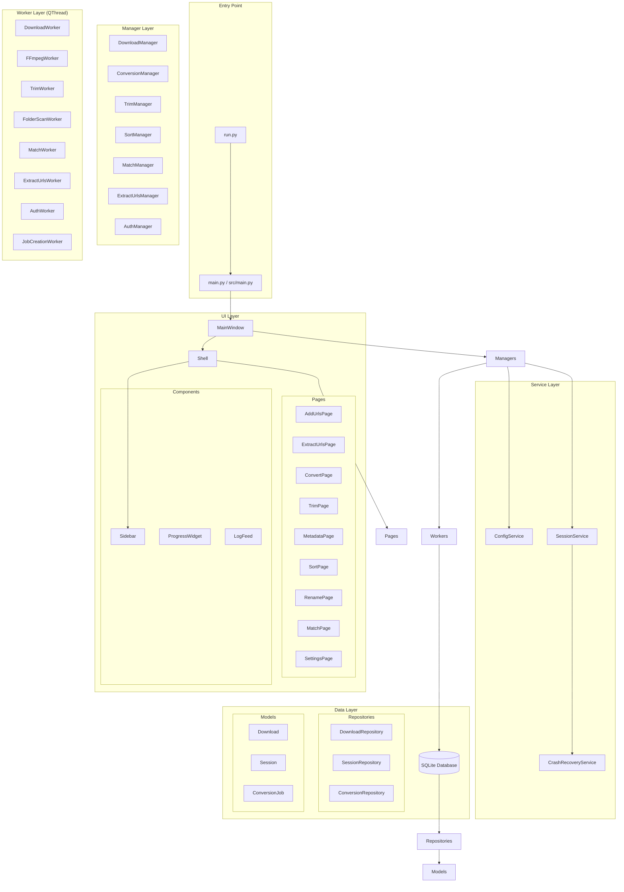
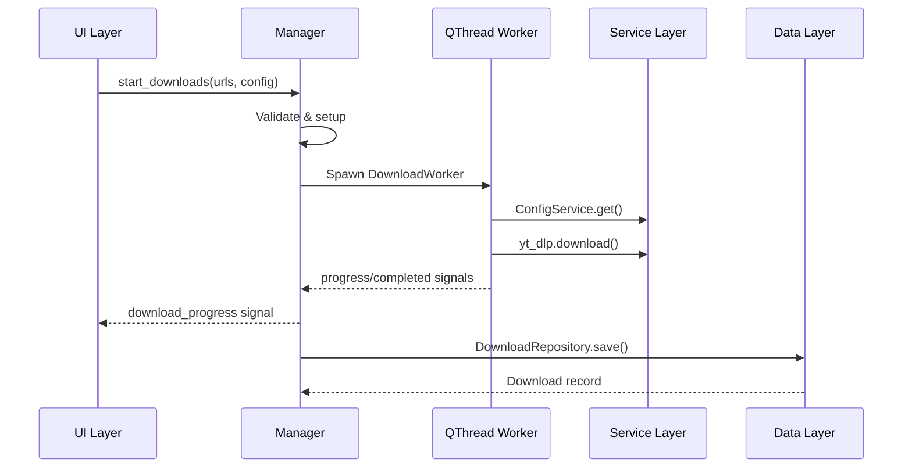
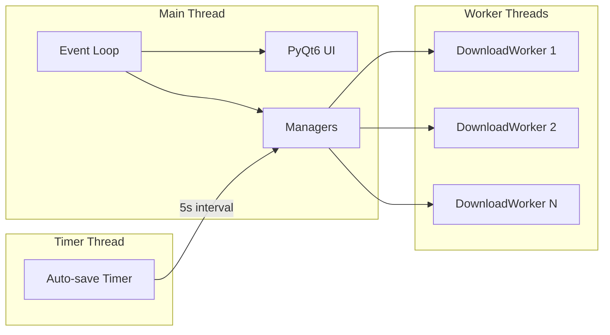
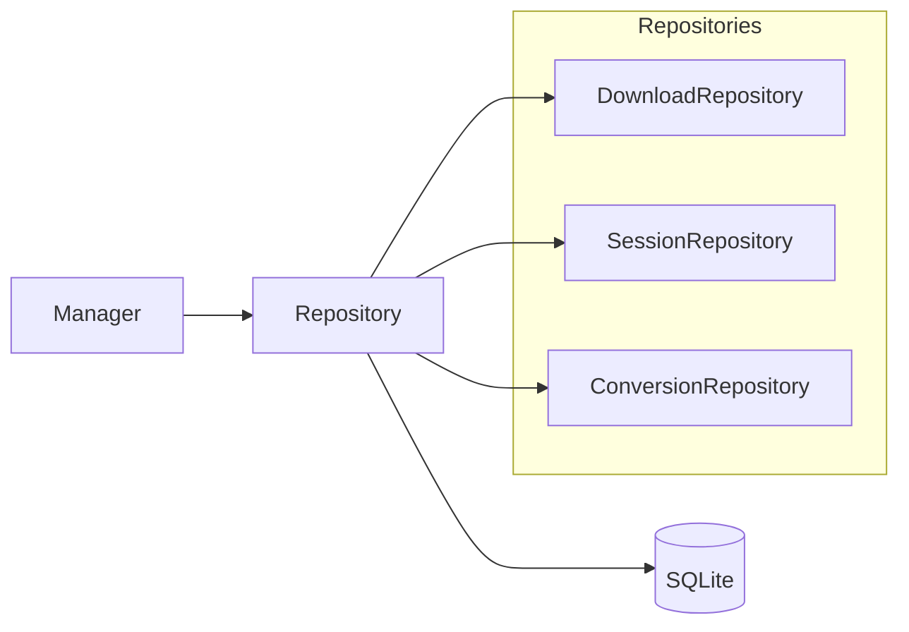
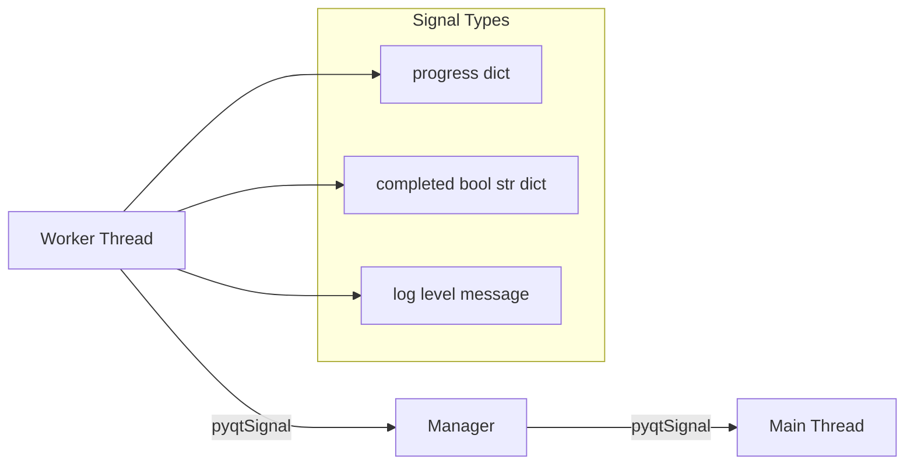
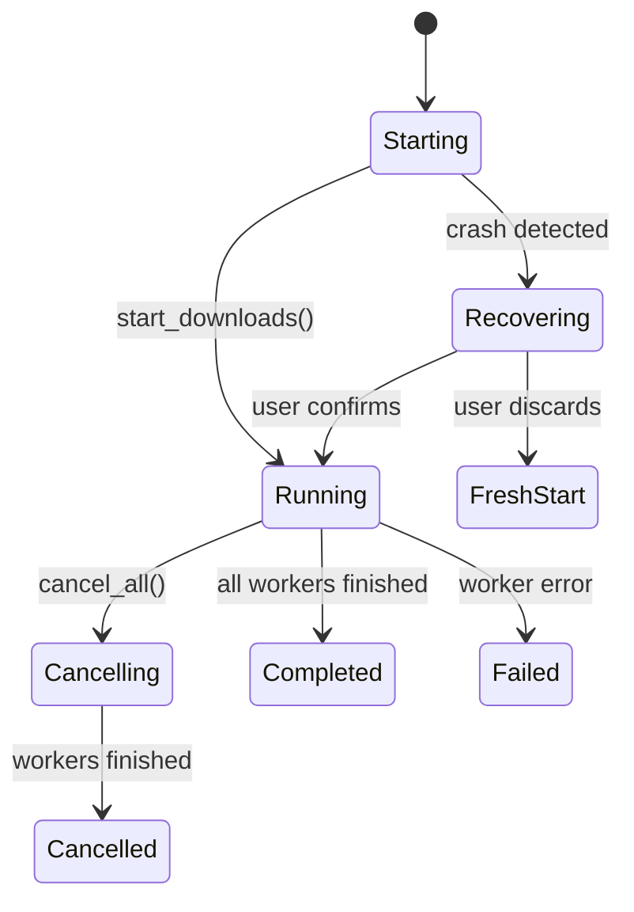
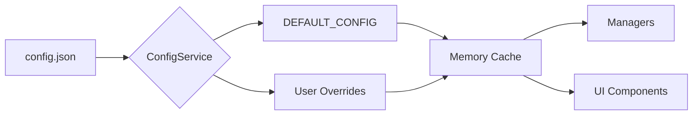
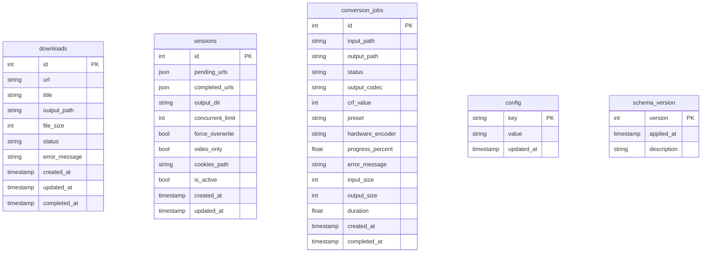
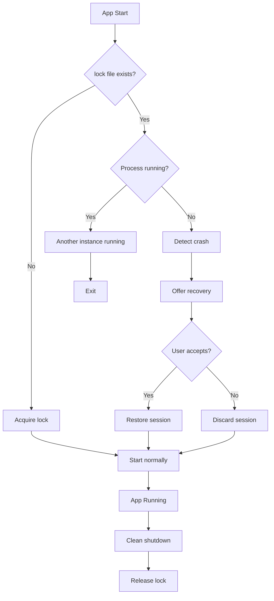

# Architecture Overview

This document describes the system architecture of yt-dlp GUI, a PyQt6-based desktop application for video downloading.

## High-Level Architecture



## Component Interaction

### Request Flow



### Threading Model



## Design Patterns

### Singleton Pattern

Used for:
- `Database` - Single database connection instance
- `ConfigService` - Single configuration instance
- `ThemeEngine` - Single theme instance

```python
class Database:
    _instance: Optional['Database'] = None
    _lock = threading.Lock()

    def __new__(cls, db_path: Optional[str] = None):
        if cls._instance is None:
            with cls._lock:
                if cls._instance is None:
                    cls._instance = super().__new__(cls)
        return cls._instance
```

### Repository Pattern

Data access abstracted through repositories:



### QThread Worker Pattern

Long-running operations run in QThread workers:

```python
class DownloadWorker(QThread):
    progress = pyqtSignal(dict)
    completed = pyqtSignal(bool, str, dict)
    log = pyqtSignal(str, str)

    def run(self):
        # Worker thread execution
        self.progress.emit(progress_dict)
        self.completed.emit(True, "Success", metadata)
```

### Signal-Slot Communication

Qt's signal-slot mechanism for thread-safe UI updates:



## Layer Responsibilities

### UI Layer (`src/ui/`)

- **MainWindow**: Orchestrates all UI components and managers
- **Shell**: Sidebar navigation and content stacking
- **Pages**: Feature-specific UI (AddUrls, Convert, Trim, etc.)
- **Components**: Reusable UI widgets (ProgressWidget, LogFeed, etc.)
- **Theme**: Dark/light theme QSS generation

### Manager Layer (`src/core/`)

Manages business logic and coordinates workers:

| Manager | Responsibility |
|---------|---------------|
| `DownloadManager` | Queue management, concurrent downloads, progress aggregation |
| `ConversionManager` | FFmpeg conversion job queue and processing |
| `TrimManager` | Video trimming job queue |
| `SortManager` | Video sorting by metadata criteria |
| `MatchManager` | Online database matching workflow |
| `ExtractUrlsManager` | Playwright-based URL extraction |
| `AuthManager` | Browser authentication and cookie export |

### Worker Layer (`src/core/`)

QThread-based background workers:

| Worker | Parent Manager | Function |
|--------|---------------|----------|
| `DownloadWorker` | DownloadManager | Single URL yt-dlp download |
| `FFmpegWorker` | ConversionManager | Single file FFmpeg conversion |
| `TrimWorker` | TrimManager | Single file video trimming |
| `FolderScanWorker` | SortManager | Scan folder for video metadata |
| `MatchWorker` | MatchManager | Online database lookups |
| `ExtractUrlsWorker` | ExtractUrlsManager | Playwright page scraping |
| `AuthWorker` | AuthManager | Browser login automation |

### Service Layer (`src/services/`)

Application-wide state management:

| Service | Responsibility |
|---------|---------------|
| `ConfigService` | JSON configuration with atomic saves, migration |
| `SessionService` | Session state tracking with auto-save |
| `CrashRecoveryService` | Lock-file based crash detection |

### Data Layer (`src/data/`)

- **Database**: SQLite connection management with migrations
- **Models**: Dataclasses for business objects
- **Repositories**: CRUD operations for each entity

## State Management



## Configuration Flow



## Database Schema



## Crash Recovery Flow



## Entry Points

| File | Purpose |
|------|---------|
| `run.py` | Development entry point |
| `main.py` | PyInstaller production entry |

```python
# run.py (development)
from src.main import main
if __name__ == "__main__":
    main()

# main.py (production with PyInstaller)
def main():
    # SingleApplication, logging, crash recovery
    app = SingleApplication(sys.argv)
    # ...
```

## See Also

- [Module Catalog](./MODULES.md) - Detailed module reference
- [API Reference](./API_REFERENCE.md) - Manager and service APIs
- [Configuration](./CONFIGURATION.md) - Configuration options
