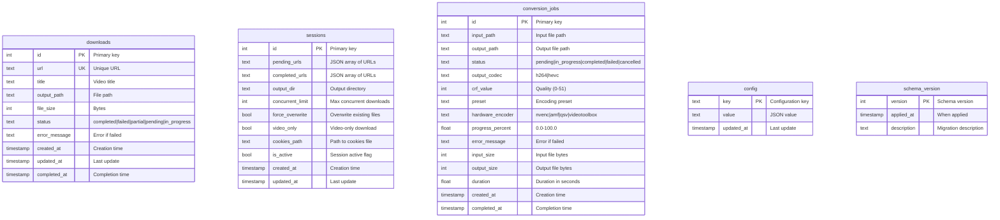

# Data Models

Database schema and data models for yt-dlp GUI.

## Database Schema

The application uses SQLite with the following tables:



## Schema Migrations

The database supports migrations through the `schema_version` table:

| Version | Description |
|---------|-------------|
| 1 | Initial schema |
| 2 | Added `updated_at` column to `downloads` table |
| 3 | Added `conversion_jobs` table |

## Enums

### DownloadStatus

```python
class DownloadStatus(Enum):
    PENDING = "pending"           # Queued but not started
    IN_PROGRESS = "in_progress"   # Currently downloading
    COMPLETED = "completed"       # Successfully downloaded
    FAILED = "failed"             # Download failed
    PARTIAL = "partial"          # Partially downloaded
```

### ConversionStatus

```python
class ConversionStatus(Enum):
    PENDING = "pending"           # Queued but not started
    IN_PROGRESS = "in_progress"   # Currently converting
    COMPLETED = "completed"      # Successfully converted
    FAILED = "failed"             # Conversion failed
    CANCELLED = "cancelled"       # Cancelled by user
```

### TrimStatus

```python
class TrimStatus(Enum):
    PENDING = "pending"
    IN_PROGRESS = "in_progress"
    COMPLETED = "completed"
    FAILED = "failed"
    CANCELLED = "cancelled"
```

### MatchStatus

```python
class MatchStatus(Enum):
    PENDING = "pending"              # Not yet matched
    SEARCHING = "searching"          # Currently searching
    MATCHED = "matched"             # Single match found
    MULTIPLE_MATCHES = "multiple_matches"  # Multiple matches
    NO_MATCH = "no_match"           # No match found
    RENAMED = "renamed"             # File renamed
    SKIPPED = "skipped"             # Skipped (e.g., already named)
    FAILED = "failed"               # Matching failed
```

### SortCriterion

```python
class SortCriterion(Enum):
    FPS = "fps"             # Frame rate sorting
    RESOLUTION = "resolution" # Resolution sorting
    ORIENTATION = "orientation" # Horizontal/vertical
    CODEC = "codec"         # Video codec
    BITRATE = "bitrate"     # Bitrate sorting
```

### RenameToken

```python
class RenameToken(Enum):
    ORIGINAL = "original"      # Original filename
    INDEX = "index"            # Sequential index
    DATE_MODIFIED = "date_modified"  # File date
    RESOLUTION = "resolution"   # e.g., 1920x1080
    FPS = "fps"               # Frame rate
    CODEC = "codec"           # Video codec
    DURATION = "duration"     # Duration
    BITRATE = "bitrate"       # Bitrate
    CUSTOM_TEXT = "custom_text"  # User text
```

## Dataclasses

### Download

Represents a downloaded video record.

```python
@dataclass
class Download:
    url: str                          # Video URL (unique)
    id: Optional[int] = None          # Database ID
    title: Optional[str] = None      # Video title
    output_path: Optional[str] = None # Output file path
    file_size: Optional[int] = None  # File size in bytes
    status: DownloadStatus = DownloadStatus.COMPLETED
    error_message: Optional[str] = None
    created_at: datetime = field(default_factory=datetime.now)
    completed_at: Optional[datetime] = None

    @classmethod
    def from_row(cls, row) -> "Download":
        """Create Download from database row."""
```

### OutputConfig

Download configuration settings.

```python
@dataclass
class OutputConfig:
    output_dir: str                   # Output directory path
    concurrent_limit: int = 3         # Max concurrent downloads
    force_overwrite: bool = False     # Overwrite existing files
    video_only: bool = False          # Download video only (no audio)
    cookies_path: Optional[str] = None # Path to cookies file
    filename_templates: Dict[str, str] = field(default_factory=dict)
                                      # Domain-specific filename templates
    default_template: str = "%(title)s"  # Fallback template
```

### Session

Session state for crash recovery.

```python
@dataclass
class Session:
    pending_urls: List[str]           # URLs not yet downloaded
    output_dir: str                   # Output directory
    concurrent_limit: int = 3
    force_overwrite: bool = False
    video_only: bool = False
    cookies_path: Optional[str] = None
    id: Optional[int] = None
    completed_urls: List[str] = field(default_factory=list)
    is_active: bool = True
    created_at: datetime = field(default_factory=datetime.now)
    updated_at: datetime = field(default_factory=datetime.now)

    def to_output_config(self) -> OutputConfig:
        """Convert session to OutputConfig."""
```

### ProgressInfo

Real-time download progress information.

```python
@dataclass
class ProgressInfo:
    url: str
    status: str = "downloading"
    percent: float = 0.0
    speed: float = 0.0              # Bytes per second
    downloaded: int = 0             # Bytes downloaded
    total: int = 0                 # Total bytes
    eta: int = 0                   # Seconds remaining
    filename: str = ""
    title: Optional[str] = None

    @property
    def speed_str(self) -> str:      # Formatted speed (e.g., "5.2 MB/s")
    @property
    def eta_str(self) -> str:        # Formatted ETA (e.g., "00:05:30")
    @property
    def size_str(self) -> str:       # Formatted size (e.g., "250 MB / 1 GB")
```

### VideoMetadata

Metadata extracted from video files via ffprobe.

```python
@dataclass
class VideoMetadata:
    file_path: str
    width: int = 0
    height: int = 0
    fps: float = 0.0
    codec: str = ""
    bitrate: int = 0
    duration: float = 0.0
    file_size: int = 0
    original_subfolder: str = ""     # Relative path from scan root

    @property
    def resolution(self) -> str:      # "1920x1080" (exact)
    @property
    def resolution_category(self) -> str:  # "1080p", "4K", etc.
    @property
    def orientation(self) -> str:    # "horizontal", "vertical", "square"
    @property
    def fps_label(self) -> str:       # "29.970fps" (3 decimal places)
    @property
    def fps_category(self) -> str:    # "30fps" (rounded)
    @property
    def bitrate_label(self) -> str:   # "5Mbps", "500kbps"
```

### ConversionConfig

Video conversion settings.

```python
@dataclass
class ConversionConfig:
    output_codec: str = "h264"       # h264 or hevc
    crf_value: int = 23             # 0-51, lower = better
    preset: str = "medium"           # ultrafast to veryslow
    use_hardware_accel: bool = False
    hardware_encoder: Optional[str] = None  # nvenc, amf, qsv, videotoolbox
    output_dir: Optional[str] = None
```

### ConversionJob

A video conversion job record.

```python
@dataclass
class ConversionJob:
    input_path: str                  # Input file path
    output_path: str                 # Output file path
    id: Optional[int] = None
    status: ConversionStatus = ConversionStatus.PENDING
    output_codec: str = "h264"
    crf_value: int = 23
    preset: str = "medium"
    hardware_encoder: Optional[str] = None
    progress_percent: float = 0.0
    error_message: Optional[str] = None
    input_size: int = 0
    output_size: int = 0
    duration: float = 0.0
    created_at: datetime = field(default_factory=datetime.now)
    completed_at: Optional[datetime] = None

    @property
    def trim_duration(self) -> float:
        """Get duration of trimmed segment (for TrimJob)."""
```

### TrimConfig

Video trimming settings.

```python
@dataclass
class TrimConfig:
    start_time: float = 0.0         # Start time in seconds
    end_time: Optional[float] = None  # End time (None = end of video)
    lossless: bool = True            # Use stream copy (fast)
    output_dir: Optional[str] = None
    suffix: str = "_trimmed"         # Output filename suffix
```

### TrimJob

A video trim job record.

```python
@dataclass
class TrimJob:
    input_path: str
    output_path: str
    start_time: float
    end_time: float
    original_duration: float
    id: Optional[int] = None
    status: TrimStatus = TrimStatus.PENDING
    lossless: bool = True
    progress_percent: float = 0.0
    error_message: Optional[str] = None
    created_at: datetime = field(default_factory=datetime.now)
    completed_at: Optional[datetime] = None
```

### SceneMetadata

Metadata for a matched scene from online databases.

```python
@dataclass
class SceneMetadata:
    title: str
    studio: str
    performers: List[str]
    date: Optional[str] = None
    duration: Optional[int] = None   # Duration in seconds
    stashdb_id: Optional[str] = None
    porndb_id: Optional[str] = None
    source_url: Optional[str] = None
    thumbnail_url: Optional[str] = None
    source_database: str = ""        # "stashdb" or "porndb"
```

### ParsedFilename

Result of parsing a video filename.

```python
@dataclass
class ParsedFilename:
    original: str                    # Original filename
    studio: Optional[str] = None
    performers: List[str] = field(default_factory=list)
    title: Optional[str] = None
    preserved_tags: List[str] = field(default_factory=list)  # Missionary, BJ, etc.
    quality_indicators: List[str] = field(default_factory=list)  # 1080p, 4K, etc.
    search_queries: List[str] = field(default_factory=list)  # Generated search terms
```

### MatchResult

Result of matching a local file to online databases.

```python
@dataclass
class MatchResult:
    file_path: str
    original_filename: str
    status: MatchStatus = MatchStatus.PENDING
    parsed: Optional[ParsedFilename] = None
    matches: List[SceneMetadata] = field(default_factory=list)
    selected_match: Optional[SceneMetadata] = None
    confidence: float = 0.0          # 0.0 to 1.0
    new_filename: Optional[str] = None
    error_message: Optional[str] = None
```

### MatchConfig

Configuration for the matching process.

```python
@dataclass
class MatchConfig:
    source_dir: str = ""
    output_format: str = "{studio} - {performer} - {title}"
    search_porndb: bool = True
    search_stashdb: bool = True
    porndb_first: bool = True        # Prioritize ThePornDB
    preserve_tags: bool = True       # Keep position tags
    include_already_named: bool = False
    custom_studios: List[str] = field(default_factory=list)
    skip_keywords: List[str] = field(default_factory=list)
```

### ExtractUrlsConfig

Configuration for URL extraction.

```python
@dataclass
class ExtractUrlsConfig:
    output_dir: str
    profile_dir: str
    auto_scroll_enabled: bool = True
    max_scrolls: int = 200
    idle_limit: int = 5              # Seconds of inactivity
    delay_ms: int = 800             # Delay between actions
    max_bounce_attempts: int = 3    # Max page reloads
```

### RenameConfig

Configuration for batch file renaming.

```python
@dataclass
class RenameConfig:
    token_order: List[RenameToken] = field(default_factory=list)
    token_enabled: Dict[str, bool] = field(default_factory=dict)
    separator: str = "_"
    custom_text: str = ""
    index_start: int = 1
    index_padding: int = 2           # Zero-padding (e.g., 01, 001)
    date_format: str = "%Y-%m-%d"
    find_text: str = ""
    replace_text: str = ""
    case_sensitive: bool = False
    use_regex: bool = False
```

## See Also

- [Architecture Overview](./ARCHITECTURE.md) - System architecture
- [API Reference](./API_REFERENCE.md) - Manager and service APIs
- [Configuration](./CONFIGURATION.md) - Configuration reference
