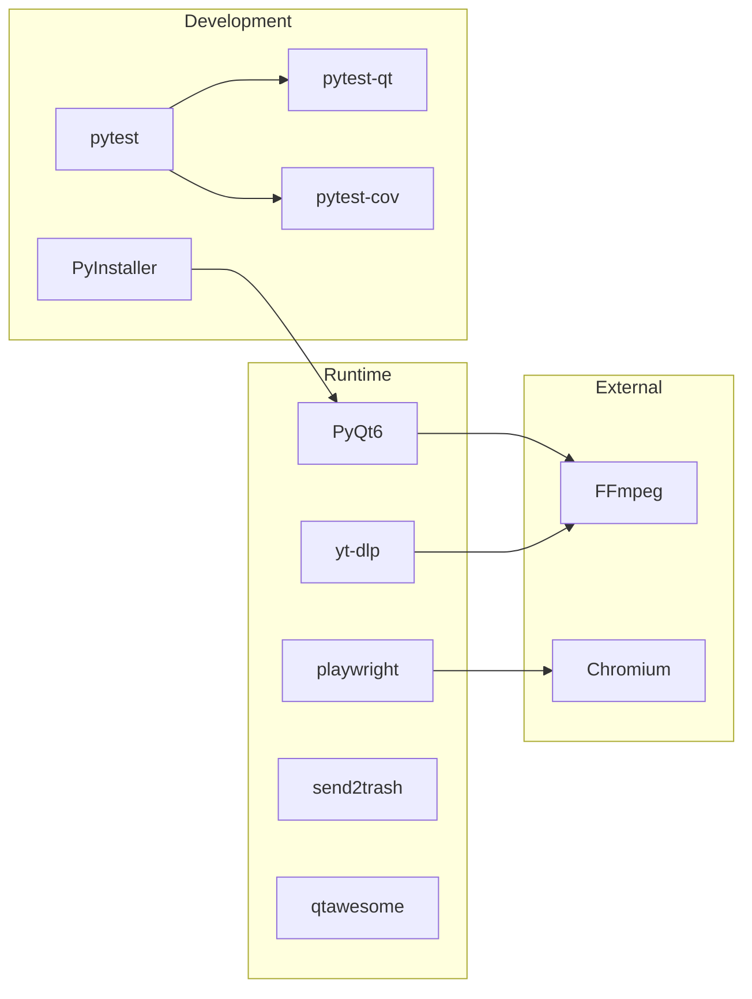

# Dependencies

Documentation for yt-dlp GUI dependencies.

## Runtime Dependencies

### Core Dependencies

#### PyQt6

**Version**: >= 6.7.0  
**Purpose**: GUI framework  
**License**: GPL v3  
**Install**: `pip install PyQt6`

Qt for Python binding providing:
- Window management
- Widget system
- Signal-slot mechanism
- Networking (QLocalSocket for single-instance)

#### yt-dlp

**Version**: >= 2024.4.9  
**Purpose**: Video downloading  
**License**: Unlicense  
**Install**: `pip install yt-dlp`

Handles:
- URL extraction and validation
- Video format selection
- Progress reporting
- Cookie handling
- Rate limiting and retries

#### playwright

**Version**: >= 1.42.0  
**Purpose**: Browser automation  
**License**: Apache 2.0  
**Install**: `pip install playwright && playwright install chromium`

Used for:
- URL extraction from web pages
- Site authentication (cookie export)
- Dynamic content scraping

#### send2trash

**Version**: >= 1.8.2  
**Purpose**: Safe file deletion  
**License**: BSD  
**Install**: `pip install send2trash`

Moves files to system trash instead of permanent deletion:
- Cross-platform support
- Respects system trash on macOS, Windows, Linux

#### qtawesome

**Version**: >= 6.6.0  
**Purpose**: Font Awesome icons  
**License**: MIT  
**Install**: `pip install qtawesome`

Provides:
- Font Awesome icon set
- Material Design icons
- Phosphor icons

## Optional Dependencies

### FFmpeg

**Purpose**: Video conversion, trimming, metadata extraction  
**License**: LGPL v2.1+  
**Install**: Platform-specific (see below)

Not a Python package; must be installed separately:
- **macOS**: `brew install ffmpeg`
- **Windows**: Download from https://ffmpeg.org/download.html
- **Linux**: `sudo apt install ffmpeg`

Required binaries:
- `ffmpeg`: Conversion and trimming
- `ffprobe`: Metadata extraction

### yt-dlp (bundled)

yt-dlp updates frequently. For best compatibility:
```bash
pip install --upgrade yt-dlp
```

## Development Dependencies

### Testing

#### pytest

**Version**: == 8.3.4 (pinned in requirements-dev.txt)  
**Purpose**: Test framework  
**Install**: `pip install -r requirements-dev.txt`

#### pytest-qt

**Version**: == 4.4.0 (pinned in requirements-dev.txt)  
**Purpose**: PyQt6 test support  
**Install**: `pip install -r requirements-dev.txt`

Provides:
- `qtbot` fixture
- Signal testing utilities
- Widget testing helpers

#### pytest-cov

**Version**: == 6.0.0 (pinned in requirements-dev.txt)  
**Purpose**: Coverage reporting  
**Install**: `pip install -r requirements-dev.txt`

### Build

#### PyInstaller

**Version**: == 6.11.1 (pinned in requirements-dev.txt)  
**Purpose**: Create standalone executables  
**Install**: `pip install -r requirements-dev.txt`

Used for:
- Creating `.exe` on Windows
- Creating `.app` bundle on macOS
- Linux distribution

## Dependency Diagram



## Version Compatibility

### Python Version

- **Minimum**: Python 3.10
- **Recommended**: Python 3.11+

### Qt Version

- PyQt6 6.7.0+ requires Qt 6.7+
- PyQt6 6.6.0+ requires Qt 6.6+

### yt-dlp

yt-dlp releases frequently. Check compatibility:
```bash
yt-dlp --version
```

### Playwright

Playwright browser versions must match library version:
```bash
playwright install chromium
```

## Installation Guide

### Full Installation (Development)

```bash
# Clone repository
git clone https://github.com/pb/ytdlp-gui.git
cd ytdlp-gui

# Create virtual environment
python -m venv venv
source venv/bin/activate  # On Windows: venv\Scripts\activate

# Install all dependencies (runtime + dev)
pip install -r requirements-dev.txt

# Install Playwright browsers
playwright install chromium

# Install FFmpeg (platform-specific)
# macOS:
brew install ffmpeg
# Ubuntu/Debian:
sudo apt install ffmpeg
```

### Production Installation

```bash
# Install runtime dependencies only
pip install PyQt6 yt-dlp playwright send2trash qtawesome

# Install Playwright browsers
playwright install chromium

# Install FFmpeg
# (platform-specific)
```

## Uninstalling

```bash
# Remove application
pip uninstall PyQt6 yt-dlp playwright send2trash qtawesome

# Remove Playwright browsers
playwright uninstall chromium
```

## Troubleshooting

### PyQt6 Installation Fails

**Issue**: No matching distribution for PyQt6  
**Solution**: Ensure Python 3.10+ and use `pip install PyQt6`

**Issue**: Qt platform plugin not found  
**Solution**: `pip install PyQt6`

### playwright Installation Fails

**Issue**: Browser download fails  
**Solution**: 
```bash
pip install playwright
playwright install --force chromium
```

### FFmpeg Not Found

**Issue**: "FFmpeg not found" warning  
**Solution**: Install FFmpeg and ensure it's in PATH

```bash
# Verify installation
ffmpeg -version
```

### Import Errors

**Issue**: Missing module errors  
**Solution**: Reinstall dependencies
```bash
pip uninstall -r requirements.txt
pip install -r requirements.txt
```

## See Also

- [BUILD_TEST_RUN](./BUILD_TEST_RUN.md) - Build and run procedures
- [Architecture Overview](./ARCHITECTURE.md) - System architecture
